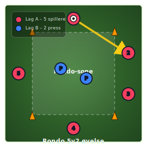

# A23 – Rondo 5v2 (forbedret versjon)

## Hensikt
Forbedret rondo-øvelse for å trene pasningsspill, press og ballbesittelse.

## Oppsett
*   **Spillere:** 5 røde spillere (Lag A) i sirkel, 2 blå pressende spillere (P) i midten.
*   **Utstyr:** 1 ball, 4 kjegler som markerer området.
*   **Område:** Avgrenset område markert med kjegler. Grønn bane-bakgrunn for diagram.

## Gjennomføring
*   Ballen starter hos spiller 1 (rød).
*   Lag A (røde spillere) spiller ballen i pasningsspill til spiller 2. Målet er å holde ballen i laget og unngå at de blå pressende spillerne vinner ballen.
*   De blå spillerne (P) forsøker å erobre ballen. Ved brudd bytter roller.

## Fokus
*   **Ballbesittelse:** Opprettholde ballbesittelse under press.
*   **Pasningskvalitet:** Presise og tempo i pasninger.
*   **Bevegelse uten ball:** Skape rom og støtte for ballfører.
*   **Press-spill (blå spillere):** Organisert og effektivt press for å vinne ballen.

## Diagram

